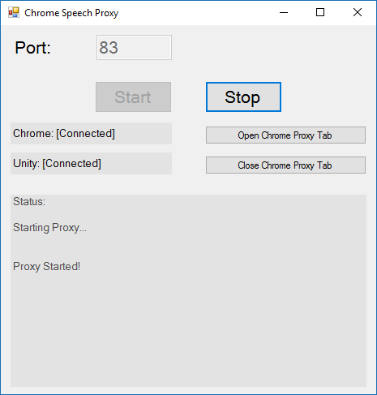

# Chrome Speech Proxy

The Chrome Speech Proxy makes it possible to use the `Speech API` on non-WebGL platforms.

# See Also

The WebGL For Speech Detection package is available in the [Unity Asset Store](https://www.assetstore.unity3d.com/en/#!/content/81076).

The WebGL For Speech Synthesis package is available in the [Unity Asset Store](https://www.assetstore.unity3d.com/en/#!/content/81861).

# Dependencies

* The [Chrome Browser](https://www.google.com/chrome/) must be installed in order to use the proxy.

# Intro

The `Chrome Speech Proxy` is a `Windows Form` application that proxies speech data between the `Chrome Browser` and Unity.
The proxy supports speech detection and speech synthesis.
The proxy requires `admin` rights to host the `HTTP` server.
The `Chrome Browser` and `Unity` communicate with the proxy and the proxy passes data between the `Chrome Browser` and `Unity`.

# Releases

* Download [Chrome Speech Proxy Installer (Windows)](https://github.com/tgraupmann/ChromeSpeechProxy/releases/tag/1.0)

# Quick Start

1 Launch the proxy

2 Open the `Chrome Proxy Tab`

3 Set the proxy port to an available port that `Unity` has assigned

4 Start `Unity` and connect

# Screenshot

